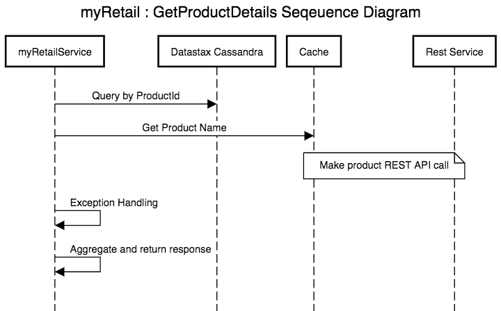

# myRetail Application

myRetail is a  Spring Boot, Cassandra, Ehcache based Application which provides simple retail fucntionality to lookup a product by its identifier and update the same.

# Database - Cassandra using Datastax Astra 

DataStax Astra Database-as-a-Service is Cassandra Made Easy in the Cloud. It provides enterprise level of reliability, security and management. This application uses Cassandra for the reliability and resilience to handle big workloads with zero downtime. Bringing in Astra would ensure true Cassandra-as-a-Service with no-ops. 

# Sprint Boot - Microservices 

myRetail application is built using sprint boot and follows the microservices architecture. Sprint boot greatly reduces the need of having boilerplate code and XML configurations. The application is also backed with enough logging, unit test cases and configuration management. 

# Ehcache 

The Application also use in memory cache using Ehcache for caching product name/brand as fetched from external http call. this provides quick lookup for product metadata on receiving requests for same product identifier. Ehcache being in memory is limited and follows LRU,LFU or FIFO caching policies to evict entries when brimming to the assigned memory threshold. We have used LRU here. As the service grows and the product inventory it is suggested to have distributed cache to abe able to scale and be highly available and fault tolerant.

# API(s) Documentation

## GetProductDetails

URL: http://127.0.0.1:8080/myretail/product/13860428

Method: GET

Response:

{

    "id": 13860428,
    
	"productCode": "65654674567",
    
	"product_detail": {
    
        "name": "The Big Lebowski (Blu-ray)",
        
        "brand": "Universal Home Video"
    
    },
    
    "current_price": {
        
        "value": 135,
		
        "currency_code": "USD"
	
    }

}

Error Case:

Http Status code: 404 - If Product with given id is not available

Http Status code: 400 - Bad request

## UpdateProductDetails

URL: http://127.0.0.1:8080/myretail/product/13860428

Method: PUT

Request Body (JSON):

{

	"id": 13860428,

	"productCode": "65654674567",

	"product_detail": {

		"name": "The Big Lebowski (Blu-ray)",

		"brand": "Universal Home Video"

	},

	"current_price": {

		"value": 153,

		"currency_code": "USD"

	}

}

Http Response

Http Status: 200 OK
Response Body (JSON)

{

	"id": 13860428,

	"productCode": "65654674567",

	"product_detail": {

		"name": "The Big Lebowski (Blu-ray)",

		"brand": "Universal Home Video"

	},

	"current_price": {

		"value": 153,

		"currency_code": "USD"

	}

}

# myRetail Sequence Diagram

